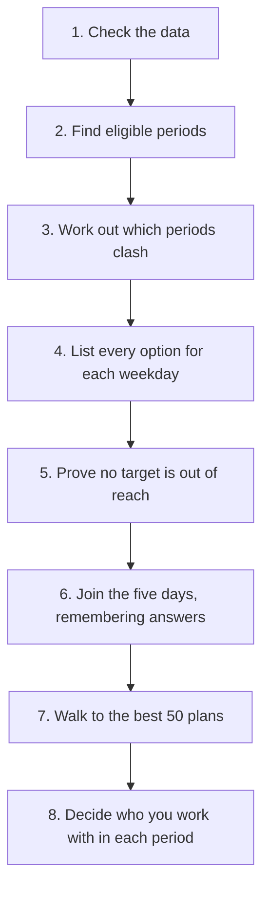

# How the plan search works

This document explains what the program calculates and how. It assumes no
background in scheduling or algorithms. Read the first two sections and you
will understand the idea; read on for the details.

---

## 1. The idea in five sentences

You are a support teacher. Your students sit in ordinary classes all over the
timetable, and you visit those classes to work with them. The timetable itself
is fixed and never changes — the only thing you choose is **which periods you
walk into**. The program works out every combination of periods that is
physically possible and meets every student's required minutes, then shows you
the ones that best match your preferences.

The whole method rests on two observations:

- **Monday can never clash with Tuesday.** So instead of one huge puzzle, there
  are five small ones that are solved separately and then combined.
- **Only your progress matters, not how you got there.** Two different Mondays
  that leave every student on the same number of minutes are interchangeable for
  the rest of the week, so the program works out the rest once and reuses it.

That is the entire algorithm. Everything below is detail.

---

## 2. Words used in this document

| Word | Meaning |
| --- | --- |
| **School** | A building. Moving between schools costs travel time. |
| **Class** (*turma*) | A group of pupils, e.g. 5.º A. Belongs to one school. |
| **Period** | One slot in the timetable: a class, a weekday, a start and end time, and a subject. |
| **Student** | Someone on your caseload. Belongs to one class. |
| **Target** | Minutes a student must receive, optionally split per subject. |
| **Eligible period** | A period you are allowed to attend (section 3). |
| **Plan** | One complete choice of which periods to attend for the week. |
| **Visit** | One period inside a plan, plus who you work with in it. |

A note on naming: the app's Portuguese text calls a plan a *semana* ("week").
There is only one calendar week; what varies is the plan. The code calls it a
`Configuration`.

---

## 3. Which periods you are allowed to attend

Out of the whole timetable, most periods are irrelevant to you. A period
becomes an **eligible period** only if all of these hold:

1. **A student of yours is in that class.** Class membership is exact — a
   student in 5.º A can only be reached in 5.º A's periods.
2. **The subject counts for that student.** If a student's target lists
   required subjects, only those subjects qualify. An empty list means any
   subject counts.
3. **No other professor is already covering it.** These are the
   *assistance slots*.
4. **It does not overlap one of your free blocks.** Time you have protected.
5. **It has a sensible length** and belongs to a class that exists.

On the real timetable in `data/class-organizer.json`, this cuts **211 periods
down to 66**. Everything afterwards works on those 66.

*Code: `src/scheduler/candidates.ts`, `buildCandidates`.*

---

## 4. Which periods can go together

Two eligible periods **clash** if you could not attend both. That happens when:

- They are on the same weekday, **and**
- they overlap in time, **or** the gap between them is too short.

"Too short" means shorter than the larger of two things: your minimum break, and
the travel time if the two periods are at different schools.

Periods on **different weekdays never clash**. This sounds too obvious to
mention, but it is the single fact that makes the program fast, so it has a test
of its own guarding it.

*Code: `src/scheduler/candidates.ts`, `periodsConflict`.*

---

## 5. The minutes you have to reach

Every requirement is a minimum number of minutes. The program collects them all
into one list of **targets**:

- For each student, their total required minutes.
- For each subject split a student has, the minutes required in that subject.
- Your own required attendance for the week.

The real dataset has 21 targets: 14 student totals, 6 subject splits, and your
own attendance.

Progress towards these targets is tracked as a list of numbers in the same
order — one number per target. Crucially, **each number is capped at its
target**. Once a student has their 90 minutes, extra minutes are not recorded,
because they cannot make any plan more or less valid.

That capping is not a detail. It is what makes two different pasts genuinely
interchangeable, and therefore what makes step 6 below possible.

*Code: `src/scheduler/quotas.ts`.*

---

## 6. What makes one plan better than another

Every valid plan is equally *correct*. Preferences only decide the order they
are shown in.

Comparing preferences means putting them on one scale, and the scale used here
is **your own time**. Every plan is charged for the time it asks you to spend,
and preferences discount or surcharge those minutes. So the score is always a
negative number: it is the cost of a plan, and the best plan is the one that
costs you least.

The weights below are given per minute, in hundredths, so that a whole minute of
your time is 100.

| Rule | Per minute |
| --- | --- |
| A minute attending anything | −100 |
| …in a favourite subject | +50 |
| …on a favourite weekday | +25 |
| …on an avoided weekday | −25 |
| …inside your preferred hours | +15 |
| A minute travelling between schools | −100 |
| A minute past your daily maximum | −100 on top |

Read a row as a comparison: a minute teaching a favourite subject costs half as
much as a minute teaching anything else, and a favourite weekday is worth half
as much again as the subject. No preference can drown out another, and travel
costs exactly what it really costs — time.

**The discounts never add up to the price.** The best a minute can do is
50 + 25 + 15 = 90, against the 100 it costs. A period therefore always leaves a
plan worse off than not attending it. This is deliberate: it is what stops the
program padding a plan with classes nobody needs, because there is no
preference attractive enough to make a pointless hour look like a good idea.
Preferences still decide freely between plans that ask for the *same* amount of
your time, which is where they matter.

Finally, every rule applies either to a single period or to a single day —
**no rule spans two days**. That means a plan's score is exactly the sum of its
five daily scores, which the search relies on.

*Code: `src/scheduler/score.ts`, `VALUE_PER_MINUTE`.*

---

## 7. Why the obvious method does not work

The obvious method is to walk through the periods one at a time, trying "attend"
and "skip" for each, and collect whatever works. That is what this program used
to do, and on the real timetable it took **23 seconds** and examined **8.2
million** branches.

The reason is arithmetic. Those 66 eligible periods can be combined about
**39.5 billion** ways. Any method that treats the week as one long list of
yes/no decisions is walking around inside that number.

---

## 8. A complete worked example

Here is a tiny timetable, small enough to check by hand. One school, one class,
one student.

- **Ana** needs **90 minutes**.
- **You** need **90 minutes** of attendance.
- Three eligible periods:

| Label | Day | Time | Length |
| --- | --- | --- | --- |
| A | Monday | 09:00–09:45 | 45 min |
| B | Monday | 09:30–10:15 | 45 min |
| C | Tuesday | 09:00–09:45 | 45 min |

A and B overlap, so they clash. Progress is written as
`(Ana's minutes, your minutes)`, each capped at 90.

### Step one: list each day's options

For every weekday, list every clash-free set of periods — including attending
nothing, which is always allowed.

| Day | Options | Progress each adds |
| --- | --- | --- |
| Monday | `{}`, `{A}`, `{B}` | `(0,0)`, `(45,45)`, `(45,45)` |
| Tuesday | `{}`, `{C}` | `(0,0)`, `(45,45)` |
| Wed, Thu, Fri | `{}` | `(0,0)` |

Note that `{A,B}` is absent: it was excluded at this stage, so the rest of the
search never has to think about clashes again.

### Step two: join the days, remembering what you work out

Start from `(0,0)` and go day by day.

Take Monday's three options in turn.

- **Monday `{}`** leaves progress at `(0,0)`. Before exploring further, the
  program asks: what is the *most* the remaining days could add? Tuesday's best
  is `(45,45)`, and the other days add nothing. So the best reachable total is
  `(45,45)` — short of 90. **This branch is impossible and is dropped**, without
  ever looking at Tuesday.

- **Monday `{A}`** leaves progress at `(45,45)`. Now work through Tuesday:
  `{}` finishes at `(45,45)`, which fails; `{C}` finishes at `(90,90)`, which
  succeeds. So from `(45,45)` there is **exactly one** way to finish.
  The program **writes that down**.

- **Monday `{B}`** leaves progress at... `(45,45)` — the same as `{A}`. The
  answer is already known, so Tuesday is not examined again. **One** way to
  finish.

### Step three: the result

Two valid plans: `{A, C}` and `{B, C}`. Both give Ana 90 minutes and you 90
minutes.

This miniature example already shows all three mechanisms the real search uses:

1. **Clashes are handled once**, per day, and then forgotten.
2. **Dead ends are proven dead** by asking what the remaining days could
   possibly deliver, and abandoned without exploration.
3. **Repeated situations are answered once.** `{A}` and `{B}` are different
   Mondays with identical consequences.

Nothing else is going on in the real version. It is the same three moves on a
bigger timetable.

---

## 9. The algorithm as run

Eight steps, in order.

**1. Check the data.** Missing classes, students with no class, targets of zero
minutes, and similar problems are reported immediately. This used to happen
*after* the search, so a typo cost you the whole search first.

**2. Find eligible periods.** Section 3. On the real data, 211 → 66.

**3. Work out which periods clash.** Section 4. Computed once for every pair.

**4. List every option for each weekday.** Section 8, step one. On the real
data this gives **196, 152, 57, 388 and 60** options for Monday to Friday —
**853 in total**, built in about 8 milliseconds. Compare that with the 39.5
billion combinations of step 7 above: the same information, organised so it can
be used.

**5. Prove no target is out of reach.** For each target, add up the most any
single day could contribute. If that optimistic total still falls short of a
target, no plan exists, and the program says exactly which target failed and by
how much — for example *"Ana (total) precisa de 60 minutos, mas no máximo
consegue 50."*

**6. Join the five days.** The core step. Working from Monday to Friday, for
each situation reached, try each of that day's options. A branch is abandoned on
**only two grounds**:

- it is **impossible** — the remaining days cannot deliver enough (the check
  from step 5, applied to the days that are left);
- it is **already answered** — this day with this capped progress was solved
  before, so the stored answer is reused.

Critically, a branch is **never** abandoned for having already succeeded. That
was the old behaviour and it meant the program could not see any plan that did
more than the bare minimum — so a preference for a subject could never actually
pull the timetable towards more of it.

Each situation is stored with two facts: **how many** ways there are to finish
from it, and the **best score** achievable from it. The first gives the exact
total number of plans. The second makes step 7 easy.

On the real data this remembers **31,245** distinct situations.

**7. Walk to the best 50 plans.** Because step 6 recorded the best score
reachable from every situation, the program can choose the most promising option
at each day and stop as soon as no remaining option could beat the worst plan
already on the list. Only 50 plans are ever held in memory — the old version
built every plan it found (over five million, in one test) and then threw away
all but 50.

**8. Decide who you work with in each period.** Section 10.

*Code: `src/scheduler/enumerate.ts` ties these together; steps 4, 6 and 7 live
in `dayPlans.ts`, `join.ts` and `join.ts` respectively.*

---

## 10. Who you work with in each period

Steps 1–7 decide which periods you attend. This step fills in the people.

Walking through the chosen periods in chronological order, each period is
credited to **every eligible student who still needs it** — where "still needs
it" means their total is not yet met, or their split for that subject is not yet
met. A student whose targets are already covered is left out, so the plan reads
`60 / 60` rather than `110 / 60`.

That produces three kinds of visit:

| Kind | Meaning |
| --- | --- |
| `one_on_one` | One student still needed this period. |
| `group` | Several did. |
| `presence` | Nobody did — you are there only to reach your own required minutes. |

A `presence` visit is an hour spent on nobody's behalf, so it only ever earns
its place by lifting you to your own required total. If you see one in a
proposed plan, removing it would drop you below your own minimum — the rule in
the next section guarantees it.

This runs **after** the search, and it is safe to do so. During the search,
progress is capped at each target, so crediting a student who is already
finished adds nothing to the situation. Searching with "everyone eligible" and
reporting "everyone who still needed it" therefore produce identical plans, and
searching the simpler way keeps the daily options fixed rather than depending on
the order days are considered.

*Code: `src/scheduler/visits.ts`.*

---

## 11. No plan may waste an hour of your time

A plan is only offered if **every period in it is load-bearing**: drop any one
of them, and some requirement breaks. Plans that fail this are counted but
never proposed.

This matters more than it sounds. Meeting every target does not make a plan
worth having — you can always attend an extra class on top of a working plan,
and the result still meets every target. Those padded plans outnumber the real
ones, and they are what put a pointless hour in front of you.

The tempting shortcut is to reject a period the moment you reach it with
nothing left to gain. That is not enough, and the reason is worth understanding.
Suppose you need 1,100 minutes of attendance. On Monday you sit in a class no
student needs, and at that point it genuinely counts — you are well short of
1,100. But Thursday's classes, which students *do* need, then carry you past
1,100 anyway. Monday's hour has become unnecessary, and nothing you could have
known on Monday would have told you. **Necessity is a property of the finished
plan, not of the moment you choose a period.**

So the check happens once a plan is complete, which is cheap: only the plans
being considered for the list are ever checked, and each check is one pass per
period.

One consequence is worth spelling out, because it shows up in the app. The
number of possible plans and the number offered are different figures. For the
real timetable, 2,437 combinations meet every target, but the ones offered are
drawn only from those with nothing removable. Counting the offered plans exactly
would mean listing all of them, which is not something the program can promise
to do — see section 13.

*Code: `src/scheduler/quotas.ts`, `everyPeriodIsNeeded`.*

---

## 12. Why the answers can be trusted

Three things back this up.

**It agrees with brute force.** `join.test.ts` works the answers out the slow,
obvious way — try every clash-free combination and measure each one — then
checks the fast method against it on five different small timetables. It
compares the number of combinations that meet every target, the number actually
offered, and the best score. The brute-force version deliberately shares no
code with the real one: it decides whether a period is needed by dropping it and
re-checking every requirement from scratch.

**Nothing offered contains a removable period.** For each of those timetables,
every plan the search returns is re-examined by the brute-force rule, so the
guarantee in section 11 is checked against results rather than assumed.

**The score is verified against itself.** Every returned plan's score is
recompared against scoring its periods directly, so the per-day arithmetic used
during the search cannot drift from the real scoring rule.

---

## 13. Known limits

**Very loose inputs are refused, not attempted.** If a single weekday has many
periods that barely clash, the number of options for that day explodes. The
program stops at 5,000 options for one day and tells you which day and why,
suggesting you narrow the subjects or add free blocks. It does not freeze. This
happens on the real data if you let every subject count for every student:
Monday alone then has 42 eligible periods.

Raising that limit is not the fix — the work grows faster than the limit does.
The real fix, if it is ever needed, is to discard options that are beaten
outright by another option on the same day.

**The plan count is a plain number.** Beyond about nine quadrillion plans it
would lose precision. No realistic timetable comes close.

**The reported count includes plans that would never be offered.** It counts
combinations meeting every target, which is more than the number with nothing
removable (section 11). Counting the latter exactly would mean listing every
plan, and there can be far too many to list.

**Preference weights are not adjustable.** They are on one comparable scale
(section 6) and hand-picked to sensible defaults, but changing them means
editing `VALUE_PER_MINUTE` rather than a setting in the app.

**Travel time between two schools is a guess.** Each school carries one travel
figure, so the cost of moving between two of them is taken as the larger of the
pair, rather than a real school-to-school table.

---

## 14. A real timetable, in numbers

Measured against a real caseload — 9 classes across 2 schools, 14 students
needing 1,500 minutes between them, 1,100 minutes of attendance required of
you, and 7 periods already covered by other professors. That timetable is
personal data and is not part of this repository; the figures are recorded here
instead.

| | Before | Now |
| --- | --- | --- |
| Time to answer | 23.2 s | **0.6 s** |
| Work done | 8,194,533 branches | 31,245 remembered situations |
| Combinations counted | 23,076 | **2,437** |
| Hours asked of you by the best plan | 1,230 min | **1,140 min** |
| Offered plans with a removable hour | 42 of 50 | **0 of 50** |

The count changed because the old number was not a count of plans at all. It
counted the same set of periods once for every way of splitting students between
them, while missing every plan that did more than the bare minimum.

The last two rows are the point of sections 6 and 11. The old scoring paid you
per minute of a favourite subject with nothing on the other side of the ledger,
so the plan it liked best was padded: 130 minutes above the 1,100 required of
you, including an hour of Portuguese that served no student. Pricing your time
brought the best plan down to 1,140 minutes, but it only made padding
unattractive — 9 of the 50 offered plans still carried a removable hour.
Requiring every period to be load-bearing removed the last of them.

The best plan now asks 1,140 minutes of you, and its single presence visit is
there because without it you would fall to 1,090 — below your own minimum.
